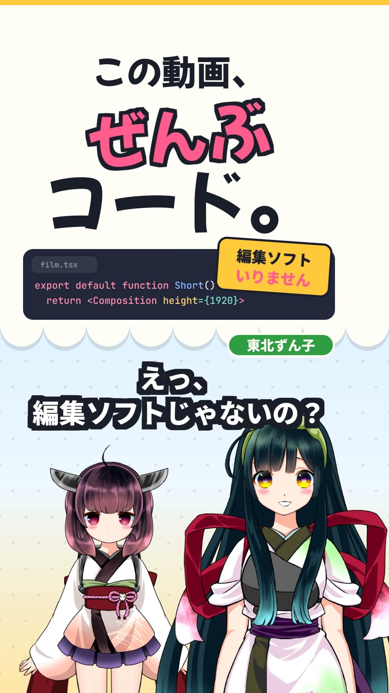

# SHORTS EXPLAINER — 1 分解説

東北きりたんが東北ずん子に Celesta を紹介する、縦型ショート（1080 × 1920 / 30 fps）の約 45 秒の解説動画。
上半分に解説パネル、中央に大きな字幕、下半分に立ち絵という、縦型解説でおなじみの配置です。
声は VOICEVOX Engine で台本から生成し、映像のタイミングはすべて生成した音声の長さから決まります。
台本を直して音声を作り直せば、字幕・口パク・パネルの切り替えがそのまま追従します。

- `film.tsx` — Celesta の File → Open… で開く React ソース（エントリ）。シーンごとの解説パネルは `scenes/`、共通部品は `components/` にあります。
- `script.ts` — 台本。話者・字幕・読み・表情を 1 行ずつ書きます。
- `make-voices.ts` — 台本を VOICEVOX Engine で読み上げ、`voices/<行>.wav` と `voices/<行>.json`（AudioQuery）を書き出します。
- `voice.ts` — `prepare()` で WAV の長さから台本を並べ（`planDialogue`）、AudioQuery から口パク（`lipSyncFromVoicevox`）とモーラの時刻を作ります。
- `character.ts` — 2 人の PSD 立ち絵の表情・口・まばたきの設定。
- `prepare-assets.ts` — 立ち絵の PSD を公式サイトから取得し、縮小して `assets/` に置きます。
- `make-score.py` — BGM を生成する Python スクリプト。標準ライブラリのみ。
- `poster.jpg` — 書き出した映像から抽出した静止画。



## 構成

| 時間 | シーン | パネルの内容 |
| --- | --- | --- |
| 0–5 秒 | つかみ | 0 フレーム目から「この動画、ぜんぶコード。」。「編集ソフトじゃないの？」に「編集ソフト いりません」の付箋 |
| 5–14 秒 | 01 React で書く | `<Composition>` のコードが打ち込まれ、横のプレビューに `Rect` と `Text` が現れる |
| 14–20 秒 | 02 フレームは関数 | 実際のフレーム番号と、フレームから位置を計算したボール（直前のフレームを残像として再描画） |
| 20–26 秒 | 03 声から口パク | 話している行の AudioQuery をモーラごとに並べて声に合わせて点灯し、`lipSyncFromVoicevox` の口の形を表示 |
| 26–32 秒 | 04 レイヤーを切り替え | 話者の PSD の目・口・表情のレイヤーが、立ち絵と同じ `blinkPhase()`・口パク・台本の表情で切り替わる |
| 32–39 秒 | 05 声に合わせる | 台本 → 音声 → 映像の流れと、この動画自身のタイムライン（1 本 = 台本の 1 行、長さは WAV から） |
| 39–45 秒 | おわり | ロゴ、「動画も、コードで。」、リポジトリ、クレジット |

時間は現在の台本での目安です。台本を変えると変わります。

## 本物と演出

- **実際の機能**: `@celesta/voicevox` の `lipSyncFromVoicevox()` による口パク、`@celesta/character` の
  PSD 立ち絵（`Character` / `CharacterView`、表情ごとの眉・頬・口のレイヤー、目のレイヤーによる自動まばたき）、
  `planDialogue()` と `<DialogueSeries>` による台本のタイミングと字幕、Google Fonts の `<Font>` 読み込み
  （和文は `text=` で使う文字だけにサブセット）、`<Audio volume>` のキーフレームによる BGM のフェードアウト。
- **パネルの表示も実データ**: 03 のモーラと口の形は再生中の行の AudioQuery から、04 の目と口は立ち絵を動かしているのと
  同じスケジュールと口パクから、05 のバーは `planDialogue()` の結果から描いています。
- **演出**: 01 のプレビュー画面と 02 のボールの動き（往復）は説明のための描画で、表示しているコードはその要約です。

## セーフエリア

背景・解説パネル・立ち絵は画面全体を使っています。Shorts や TikTok の UI が重なる右端（約 150 px）と下の約 20%（y > 1536）には、
字幕・見出し・ラベルなど読ませる文字を置いていません（`constants.ts` の `SAFE`）。立ち絵だけが下端まで届きます。
字幕は 74 px の太字に縁取りを付け、音を出さずに見ても読める大きさにしています。

## 再生成

WAV と MP4 はリポジトリ全体の設定で、`voices/` と `assets/` はこのフォルダの `.gitignore` で、Git の管理対象外です。
クローン後はリポジトリのルートから次の順に実行します。`make-voices.ts` と `prepare-assets.ts` には Node.js 23.6 以降が必要です。
`make-voices.ts` は追加のパッケージを使いません。`prepare-assets.ts` だけが `pnpm install` で入る ag-psd を使います。

```sh
docker run --rm -p 50021:50021 voicevox/voicevox_engine:cpu-ubuntu24.04-latest   # 別のターミナルで
node examples/shorts-explainer/make-voices.ts       # voices/*.wav と voices/*.json
pnpm install                                        # ag-psd
node examples/shorts-explainer/prepare-assets.ts    # assets/kiritan.psd と assets/zunko.psd
python3 examples/shorts-explainer/make-score.py     # score.wav
node skills/celesta/scripts/inspect.mjs examples/shorts-explainer/film.tsx --every 30
Celesta-export --react examples/shorts-explainer/film.tsx examples/shorts-explainer/shorts-explainer.mp4
```

ソースから実行する場合は `Celesta-export` を `cargo run -p celesta-exporter --release --` に置き換えます。
VOICEVOX Engine を別の場所で動かしている場合は `VOICEVOX_URL` を設定してください。
フォントは初回に Google Fonts から取得され、以降はキャッシュされます。

台本を直すときは `script.ts` を編集して `make-voices.ts` を実行し直すだけです。
字幕の【】で囲んだ語は話者の色で強調されます。英字の名前など VOICEVOX が読み違える語は `reading` に読みを書きます。

## 話者と立ち絵の選び方

- 声と立ち絵がどちらも同じ権利者（東北ずん子・ずんだもんプロジェクト、SSS 合同会社）のキャラクターで、
  公式 PSD をログインなしで取得できる組み合わせとして、東北きりたんと東北ずん子を選びました。
- 立ち絵の PSD は公式素材（[zunko.jp イラスト素材](https://zunko.jp/con_illust.html)）を `prepare-assets.ts` で取得します。
  [キャラクター利用ガイドライン](https://zunko.jp/guideline.html)では、非商用の利用は申請なしで可能で、
  プログラミングなどの使い方を解説する目的では例外的に商用利用も認められています。プロジェクトのキャラクター同士を一緒に使うことも可能です。
  素材そのものの再配布はしないため、PSD はリポジトリに含めず、取得スクリプトだけを置いています。
  取得時に、各レイヤーを 2400 px の高さに縮小します（キャラクターとわかる範囲の加工で、レイヤー構成はそのままです）。
  きりたんの背中の「きりたん砲」のレイヤーは、縦型のバストショットで顔まわりが混み合うため表示していません。
- 音声は [音源利用規約](https://zunko.jp/con_ongen_kiyaku.html) に従い、動画内（おわりの画面）とこの README にクレジットを表記しています。

## クレジット

- 音声：VOICEVOX:東北きりたん、VOICEVOX:東北ずん子
- 立ち絵：東北ずん子・ずんだもんプロジェクト公式イラスト（[zunko.jp](https://zunko.jp/)）
- フォント：Noto Sans JP、Mochiy Pop One、JetBrains Mono（いずれも SIL Open Font License、Google Fonts から配信）
- 映像と BGM はこのリポジトリのためのオリジナルの手続き的制作です。
