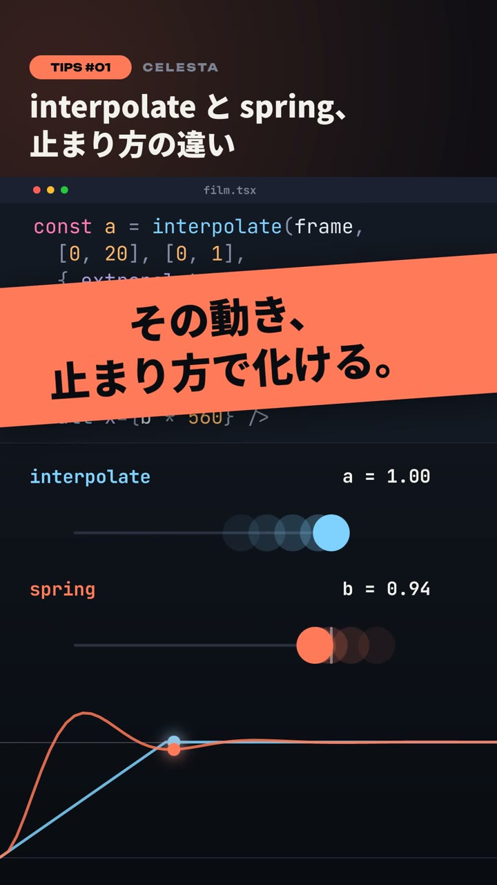

# CELESTA TIPS (vertical short)

English | [日本語](README.ja.md)

A template for vertical short videos that each show one Celesta Tip.
The upper half shows highlighted code, and the lower half runs the result that code draws.
1080 × 1920, 30 fps, 24 seconds, cut to an original 120 BPM score.

One source renders many videos. `properties.ts` declares the inputs (which Tip, the title, the code, the accent color, and so on)
with `defineProjectProperties()`, and each JSON file in `variants/` holds the values for one Tip.

- `film.tsx` — the React source (entry) to open with Celesta's File → Open….
- `properties.ts` — the template's inputs. `plan.ts` — code layout, each line's reveal time, and the checks in `prepare()`.
- `demos/` — one demo per Tip, one file each (`demos/index.ts` lists them by ID).
- `scenes/` — the three scenes: Hook, Build and Outro. `components/` — the header, the code band, the demo clock and the background.
- `variants/` — the values for each Tip. `make-score.py` — a Python script that generates the score (standard library only).
- `poster.jpg` — a still taken from an exported video.



## Structure

120 BPM (one beat = 15 frames, one bar = 60 frames). The scenes are joined with `<TransitionSeries>`, and each
transition is centered on a downbeat. Every variant has the same length.

| Time | What happens |
| --- | --- |
| 0–2 s | The finished state: the full code and the demo already running, under a band with the hook line (`hook`) |
| 2 s | A wipe from the left into an empty editor |
| 2–16 s | The code types in one line per beat slot, and the demo below builds up as each line lands |
| 16–24 s | A cross-fade turns the code band into the closing line (`closing`). The demo keeps running |

## Variants

| File | Tip | Demo |
| --- | --- | --- |
| `variants/spring.json` | interpolate vs spring | The same 0 → 1 move from both functions, their live values, and both curves over one bar |
| `variants/transition.json` | Joining scenes with `<TransitionSeries>` | A real `TransitionSeries` (Sun → wipe → Moon) replayed every bar, with a timeline that shows the overlap |
| `variants/phrase.json` | Japanese phrase line breaks (`lineBreak: 'phrase'`) | The same sentence in the same `maxWidth`, wrapped with `'normal'` and with `'phrase'` |

`variants/` holds the Japanese versions, and `variants/en/` holds the same three Tips in English.
Only `title`, `hook` and `closing` differ; the code and the demos are shared.
The phrase demo is about Japanese line breaking, so its sample sentence stays in Japanese.
Noto Sans JP, the face used for these texts, includes Latin glyphs, so English needs no other font.
English runs longer than Japanese: keep each line of `hook` to about 16 characters, and break lines with `\n`.

Each variant sets these values. Any value it leaves out takes the default from `properties.ts` (the spring Tip).

| Key | Type | Meaning |
| --- | --- | --- |
| `tip` | select | The ID of the demo shown in the lower half (a key of `demos/index.ts`) |
| `number` | number | The number in `TIPS #01` |
| `title` | string | The header title. Japanese wraps between phrases |
| `hook` | string | The line shown over the first 2 seconds |
| `code` | string | The code in the upper half, highlighted as TSX. Up to 9 lines |
| `stages` | string | The code line (1-based, comma-separated, ascending) that starts each stage of the demo. A stage starts once its line has been typed |
| `closing` | string | The closing line |
| `accent` | color | The accent color |
| `guides` | boolean | Tints everything outside the safe area red, for checking. Defaults to `false` and is never drawn in a delivered video |

The code's font size follows its longest line, from 46 down to 34 px. If a line does not fit, or the number of `stages`
does not match the demo, `prepare()` stops with an error before the first frame.

## Adding a Tip

1. Write a demo in `demos/`, one file. It draws in the lower half (1080 × 960, with the origin at that half's top-left).
   It reads time from the hooks in `components/DemoClock.tsx`: `useStage(i)` returns the frames since stage `i` started,
   and `useBarLoop(i)` returns a clock that restarts every bar, from the first downbeat after stage `i`.
   Export the number of stages as `XXX_STAGES`.
2. Register the ID, the number of stages and the component in `DEMOS` in `demos/index.ts`. The ID is added to the options of `tip` automatically.
3. Add a JSON file to `variants/`. Set `tip` to the ID, and give `stages` as many line numbers as the demo has stages.

Keep the values a demo uses (such as spring's `damping`) equal to the ones in the code snippet; they are the constants at the top of each demo.
During the first 2 seconds, every stage is treated as having started long ago, so a demo needs no separate code for its finished state.

## Safe area

Shorts, TikTok and Reels draw captions and the channel name over the bottom 20 % or so (y ≥ 1536), and buttons over the right edge (x ≥ 936).
Backgrounds, the code band and the demos' pictures use the whole frame. Readable text (the title, the code, labels and the hook and closing lines)
stays inside `SAFE` in `constants.ts`. To check, export with `--props '{"guides":true}'`: everything outside the safe area is tinted red.

## How the code is drawn

The code is highlighted with `tokenizeCode()` from `@celesta/code` and drawn as one `<Text>` per line, colored with `<Span>`.
The `<Code>` component measures text while rendering, so `inspect.mjs` cannot evaluate frames that use it.
JetBrains Mono advances every glyph by 0.6 em, so positions are computed here without measuring.
Japanese, which JetBrains Mono lacks, is drawn in Noto Sans JP through `<Span>` and counted as 1 em.
It does not depend on the operating system's font fallback, so it looks the same on every machine.
As a result, `inspect.mjs` can check every frame.

## Regenerating

WAV and MP4 files are ignored by the repository-wide Git settings. After cloning, generate the score first.

```sh
python3 examples/shorts-tips/make-score.py
node skills/celesta/scripts/inspect.mjs examples/shorts-tips/film.tsx --every 30 \
  --props-file examples/shorts-tips/variants/spring.json
Celesta-export --react examples/shorts-tips/film.tsx spring.mp4 \
  --props-file examples/shorts-tips/variants/spring.json
Celesta-export --react examples/shorts-tips/film.tsx transition.mp4 \
  --props-file examples/shorts-tips/variants/transition.json
Celesta-export --react examples/shorts-tips/film.tsx phrase.mp4 \
  --props-file examples/shorts-tips/variants/phrase.json
# English
Celesta-export --react examples/shorts-tips/film.tsx spring-en.mp4 \
  --props-file examples/shorts-tips/variants/en/spring.json
```

Export the other two English videos the same way, with the files in `variants/en/`.

When running from source, replace `Celesta-export` with
`cargo run -p celesta-exporter --release --`.
To preview with the same values, use `celesta-editor examples/shorts-tips/film.tsx --props-file examples/shorts-tips/variants/spring.json`.
The fonts are fetched from Google Fonts on first use and cached after that.

## Credits

Fonts: Unbounded, JetBrains Mono and Noto Sans JP (all under the SIL Open Font License, served by Google Fonts).
The titles and lines change with each variant, so the Japanese face is loaded whole rather than subset.
The picture and the score are original procedural work made for this repository.
