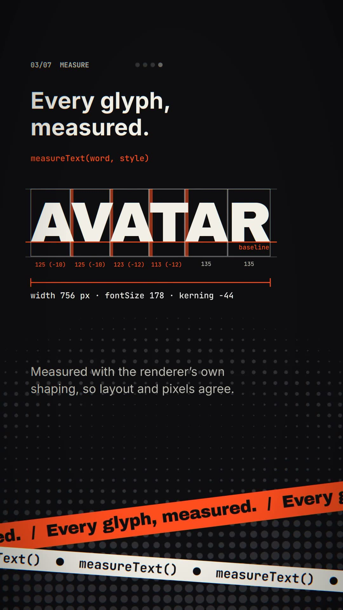

# SHORTS TYPE (English)

A 28-second vertical (1080 × 1920, 30 fps) kinetic-type short, cut to a 120 BPM
score. It is the English companion of [`shorts-type`](../shorts-type/), which
sets a Japanese manifesto: the look, the timing and the score are the same,
and the scenes show what matters when English copy has to fill a narrow
column.

- `film.tsx` — the React entry to open in Celesta (File → Open…). Scenes are in
  `scenes/`, shared parts in `components/`, the scene order in `timeline.ts`,
  and everything measured in `prepare()` in `measure.ts`.
- `make-score.py` — generates the score with Python's standard library.
- `poster.jpg` — a still from the exported video.



## Scenes

120 BPM: one beat is 15 frames, one bar 60. Every scene is two bars and starts
on a downbeat.

| Time | What happens | APIs |
| --- | --- | --- |
| 0–4 s | "WRITE YOUR / VIDEO IN / CODE.", each line larger than the last. The reveal starts before frame 0, so the first frame already shows the opening line; the headline is up by frame 12 | `fitText` (one size per line), `TextReveal`, `<Span>`, `Camera` |
| 4–8 s | "Every frame is A FUNCTION OF ITS NUMBER.", one line per beat, then the frame number itself | `fitText`, `TextReveal`, `useCurrentFrame` |
| 8–12 s | A new word every other beat, drawn over its own measurement: a box per glyph advance, the line's top, baseline and bottom, the total width. "AVATAR" shows kerning: each glyph is also measured alone, and what its pair took back is marked | `measureText`, `fitText`, `useCue` |
| 12–16 s | The box changes shape every other beat; the same copy refills it, centred, as large as it fits | `fitText`, `useCue` |
| 16–20 s | The lit word moves every beat; the highlight bars are placed from the measured glyphs, and a word takes its trailing punctuation with it | `<Span>`, `measureText`, `useCue`, `interpolateColor` |
| 20–24 s | One word per beat: "CUT / ON / THE / BEAT. / WRITE. / SAVE. / WATCH. / SHIP." | `useBeat`, `fitText` |
| 24–28 s | The opening line and the wordmark, on the opening background, so a looping player cuts back into the hook without a jump | `fitText`, `TextReveal` |

Headlines are stacked line by line (`components/FitStack.tsx`): `fitText()`
finds, for each line on its own, the largest Archivo Black size that fits the
column on one line, so every line runs the full width and the sizes give the
hierarchy. Display type is tracked in by 2% of its size. `letterSpacing` is in
pixels, so each fit runs twice: once for the size, then with the tracking that
size implies, and the line is drawn with exactly the tracking it was measured
with. English has no phrase line breaking to show, so the Japanese version's
`lineBreak: 'phrase'` scene is replaced by the measurement scene.

## Safe area

Shorts and TikTok draw their caption and progress bar over the bottom ~20% of
the frame and their buttons along the right edge. Copy meant to be read
(headlines, body, code) stays inside `SAFE` in `constants.ts` (top 192,
right 200, bottom 384, left 72 px). Backgrounds, the halftone, the tapes and
the speed lines fill the whole frame.

`components/Stage.tsx` draws those full-frame layers, then the copy inside a
`<SafeArea>` and a `<Camera>` centred on it, so a push-in grows towards every
edge of the safe area alike. To see the covered areas, turn on the `guides`
project property:

```sh
Celesta-export --react examples/shorts-type-en/film.tsx --props '{"guides":true}' --every 30 --contact-sheet sheet.png
```

## Effects

- **Halftone** (`halftone.ts`): a `@celesta/shader` filter on the background
  rect. Dots grow towards the bottom, drift up, and swell where a ring rises
  from below on every beat.
- **Finishing pass** (`fx.ts`, `components/Fx.tsx`): a shader on the whole
  frame. Every beat kicks an RGB split that grows with the square of the
  distance from the centre, so copy in the middle stays crisp; every cut gets
  7 frames of glitch slices and a 4-frame flash. That is one flash every four
  seconds, well under three per second.
- **Tapes** (`components/Tape.tsx`): two slanted bands scroll the scene's line
  and API through the platform UI area.
- **Punch-in**: each scene's copy springs in from 0.9× and starts blurred, so
  it never leaves the safe area.
- **Speed lines** (`components/Burst.tsx`): one `Path` of wedges per beat in
  the BEAT scene, with motion blur on the word.

`make-score.py` hits the same frames: an impact and a click stutter on every
cut, a kick on every beat, and a sound for each scene's cues.

## Measuring and inspect.mjs

`measureText()` and `fitText()` run once in `prepare()` and keep their results
in module variables (`measure.ts`). `<Font>` is not loaded yet at that point,
so the same Google Fonts URL is passed in `fonts`.

`inspect.mjs` cannot shape text, so every value starts as an estimate
(Archivo Black capitals about 0.86 em wide, Inter about 0.55 em) that keeps
every frame evaluable there; check how text looks with PNG frames.

## Regenerate

The WAV and MP4 are ignored by Git. After cloning, generate the score first:

```sh
python3 examples/shorts-type-en/make-score.py
node skills/celesta/scripts/inspect.mjs examples/shorts-type-en/film.tsx --every 15
Celesta-export --react examples/shorts-type-en/film.tsx shorts-type-en.mp4
```

From a source checkout, replace `Celesta-export` with
`cargo run -p celesta-exporter --release --`. The fonts (Archivo Black, Inter,
JetBrains Mono; all SIL Open Font License) load from Google Fonts on first
run and are cached. The video and score are original procedural work made
for this repository.
