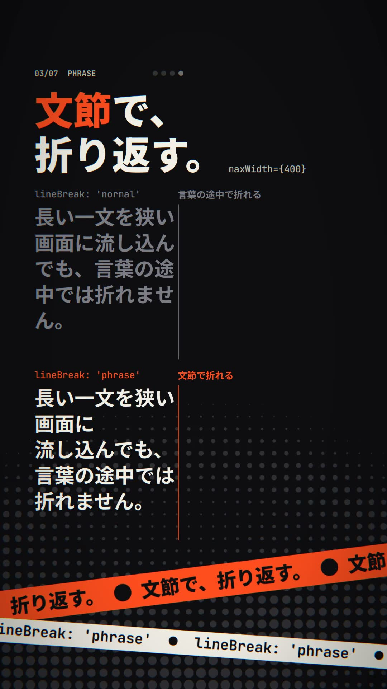

# SHORTS TYPE

縦型ショート動画（1080×1920）の和文キネティックタイポグラフィです。
「動画を、コードで書く。」から始まる短いマニフェストを、横幅の狭い画面に 120 BPM の拍に合わせて流し込みます。28 秒、30 fps。

横幅が狭いほど、文節での改行、テキストの計測と箱に収める処理、`<Span>` による部分的な強調の効き目がはっきり見えます。各シーンがそのまま使用例になっています。
英語のコピーで同じ構成にした版は [`shorts-type-en`](../shorts-type-en/) です。

- `film.tsx` — Celesta の File → Open… で開く React ソース（エントリ）。シーンは `scenes/`、共通部品は `components/`、シーンの並びは `timeline.ts`、`prepare()` で行う計測は `measure.ts` にあります。
- `make-score.py` — BGM を生成する Python スクリプト。標準ライブラリのみ。
- `poster.jpg` — 書き出した映像から抽出した静止画。



## 構成

120 BPM（1 拍 = 15 フレーム、1 小節 = 60 フレーム）。シーンはどれも 2 小節で、小節の頭で切り替わります。

| 時間 | 内容 | 主な API |
| --- | --- | --- |
| 0–4 秒 | 「動画を、コードで書く。」最初のフレームから 1 行目が見えており、12 フレームで見出しがそろう | `TextReveal`・`<Span>`・`measureText`（キャレットの位置）・`Camera` |
| 4–8 秒 | 「すべてのフレームは、フレーム番号の関数。」1 拍に 1 行ずつ入り、フレーム番号を表示する | `TextReveal`・`useCurrentFrame` |
| 8–12 秒 | 同じ一文を `lineBreak: 'normal'` と `'phrase'` で上下に並べ、2 拍ごとに幅を 760 → 400 px と狭めていく | `lineBreak`・`maxWidth`・`useCue` |
| 12–16 秒 | 2 拍ごとに形が変わる箱に、同じコピーを入る限り大きく収める | `fitText`・`useCue` |
| 16–20 秒 | 1 拍ごとに強調する文節を移す。マーカーは計測した字形の位置から引く | `<Span>`・`measureText`・`useCue`・`interpolateColor` |
| 20–24 秒 | 1 拍に 1 語。「拍に／合わせて／言葉を／落とす。／書いて、／保存して、／すぐ／確かめる。」 | `useBeat` |
| 24–28 秒 | 冒頭のコピーとワードマーク。冒頭と同じ背景で終わるため、ループ再生でも段差がない | `TextReveal` |

上部の表示（シーン番号と 4 拍のメトロノーム）は `cueAt()`・`useBeat()` で描き、`blendMode="difference"` でどの背景色の上でも読めるようにしています。

## エフェクト

文字以外の演出は、ほとんどが拍とシーンの切り替わりから計算されます。

- **背景のハーフトーン**（`halftone.ts`）：背景の `Rect` にかけた `@celesta/shader` のシェーダーです。網点は画面の下へ行くほど大きくなり、ゆっくり上へ流れます。拍ごとに、画面の下から網点をふくらませる波紋が上がります。
- **仕上げのパス**（`fx.ts`・`components/Fx.tsx`）：画面全体の `Group` にかけたシェーダーです。拍ごとに RGB をずらし（中心からの距離の二乗で効くので、中央の文字はにじみません）、シーンの切り替わりで 7 フレームの横方向のグリッチと 4 フレームのフラッシュを入れます。フラッシュは 4 秒に 1 回で、毎秒 3 回の点滅を超えません。
- **テープ**（`components/Tape.tsx`）：画面の下を斜めに横切る 2 本の帯に、シーンのコピーと API 名を流します。装飾なので、プラットフォームの UI が重なる領域にかかってもかまいません。
- **パンチイン**：各シーンの文字は、切り替わりで 0.9 倍からばねで弾んで入り、最初の数フレームはぼけています。小さい側から入るので、セーフエリアからははみ出しません。
- **集中線**（`components/Burst.tsx`）：BEAT シーンでは、1 語ごとに `Path` 1 枚の集中線が飛び、語はモーションブラーをかけて落ちてきます。

`make-score.py` も同じ時刻に合わせて、切り替わりにはインパクトとグリッチのスタッター、拍にはキックを置いています。

## セーフエリア

Shorts や TikTok は、画面の下約 20%（キャプション、プログレスバー）と右端（いいね・コメントなどのボタン）に UI を重ねます。
読ませる文字（見出し・本文・コード）は、すべて `constants.ts` の `SAFE`（上 192・右 200・下 384・左 72 px）の内側に置いています。
背景、網点、テープ、集中線のような装飾は、画面全体に描いています。

各シーンは `components/Stage.tsx` で、背景・網点・テープを全面に描き、読ませる文字だけを `<SafeArea>` の中の `<Camera>` に入れています。
カメラはセーフエリアの中心を基準に寄るので、ズームしても文字は UI 側へ寄りません。
文字の列（`COL`、幅 760 px）は、数 % のズームの余裕を見て、セーフエリアより少し狭くしてあります。

UI が重なる範囲は、`guides` プロジェクトプロパティで重ねて確認できます。

```sh
Celesta-export --react examples/shorts-type/film.tsx --props '{"guides":true}' --every 30 --contact-sheet sheet.png
```

## 計測と inspect.mjs

`measureText()` と `fitText()` は `prepare()` の中で一度だけ呼び、結果をモジュールの変数に置いています（`measure.ts`）。
`prepare()` の時点では `<Font>` がまだ読み込まれていないため、同じ Google Fonts の URL を `fonts` に渡しています。

`inspect.mjs` は文字を整形できず、計測が失敗します。
そのため各値には概算（和文の字幅を 1 em とした値）を初期値として持たせ、計測に失敗したときはその値で全フレームを評価できるようにしています。
文字の見た目は PNG で確認してください。

## 再生成

WAV と MP4 はリポジトリ全体の設定で Git の管理対象外です。クローン後は最初にスコアを生成してください。

```sh
python3 examples/shorts-type/make-score.py
node skills/celesta/scripts/inspect.mjs examples/shorts-type/film.tsx --every 15
Celesta-export --react examples/shorts-type/film.tsx shorts-type.mp4
```

ソースから実行する場合は `Celesta-export` を `cargo run -p celesta-exporter --release --` に置き換えます。
フォント（Noto Sans JP、JetBrains Mono。いずれも SIL Open Font License）は初回に Google Fonts から取得され、以降はキャッシュされます。
映像とスコアはこのリポジトリのためのオリジナルの手続き的制作です。
